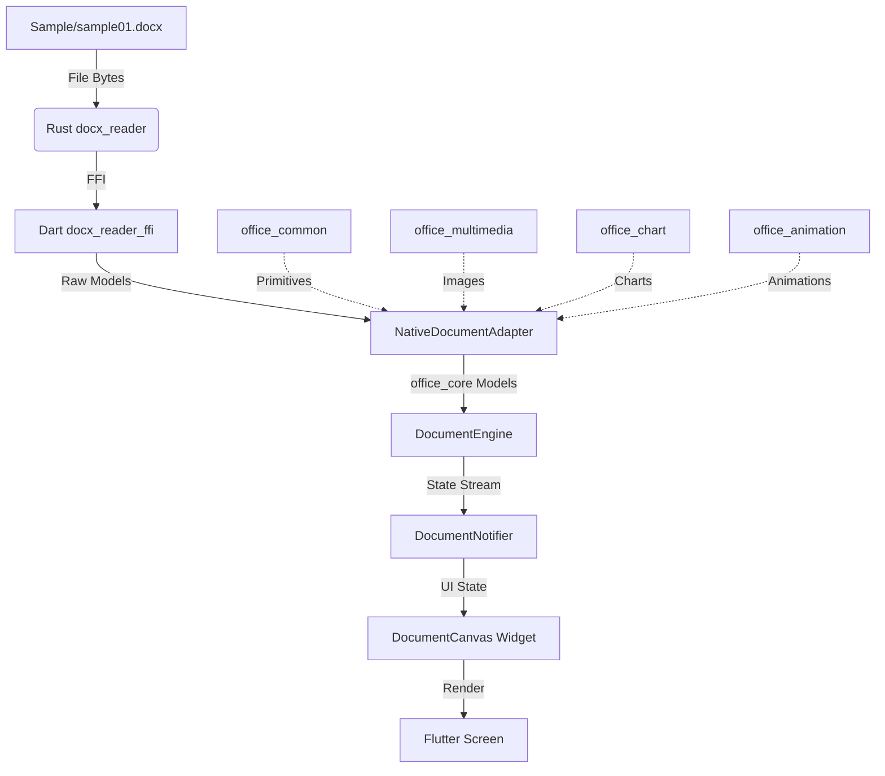

# docx_reader

A comprehensive, ergonomic Rust library for **reading, editing, and writing** `.docx` (Word) files with MS Word compatibility.

This is the core document engine for `ky_docs`, providing native performance for document operations.

---

## Architecture



## Core Components

| Component | Purpose |
|-----------|---------|
| `docx_reader` | Core DOCX parsing and extraction |
| `docx_reader_ffi` | FFI bindings for Dart/Flutter integration |
| `office_common` | Shared utilities and common types |
| `office_core` | Core document model and primitives |
| `office_multimedia` | Image and media handling |
| `office_chart` | Chart types and rendering |
| `office_animation` | Animation support |

## Features

### Parsing & Extraction

| Capability | API |
|------------|-----|
| Plain-text extraction | `extract_text()` / `extract_text_with_options()` |
| Structured parse (paragraphs, tables, lists, …) | `parse()` → `Document` |
| Metadata (author, title, dates, word count, …) | `metadata()` |
| Headings | `headings(level)` |
| Tables | `tables()` |
| Embedded images (list + bytes) | `images()` / `image_bytes()` / `save_image()` |
| Styles | `styles()` |
| Comments | `comments()` |
| Footnotes & Endnotes | `footnotes()` / `endnotes()` |
| Tracked changes (insertions & deletions) | `tracked_changes()` |
| Headers & Footers | `headers_footers()` |

### Editing & Writing

| Capability | API |
|------------|-----|
| JSON export/import | `to_json()` / `from_json()` |
| Document editing | `apply_edit()` with CRDT-compatible operations |
| Block operations | `add_paragraph()`, `add_heading()`, `delete_block()`, etc. |
| Text operations | `insert_text()`, `split_block()`, `merge_blocks()` |
| DOCX generation | `write_docx()` (via FFI) |

### Statistics & Analysis

| Capability | API |
|------------|-----|
| Word / char count | `word_count()` / `char_count()` |
| Raw XML access | `raw_document_xml()` / `read_part()` |
| Part enumeration | `part_names()` |

---

## Quick Start

Add to `Cargo.toml`:

```toml
[dependencies]
docx_reader = { path = "Modules/Engine/docx_reader" }
```

```rust
use docx_reader::{DocxReader, Document};

fn main() -> Result<(), Box<dyn std::error::Error>> {
    // Open from disk
    let reader = DocxReader::open("report.docx")?;

    // Or from bytes (useful in web handlers / tests)
    // let reader = DocxReader::from_bytes(bytes)?;

    // ── Plain text ───────────────────────────────────────────────────────
    let text = reader.extract_text()?;
    println!("{}", text);

    // ── Statistics ───────────────────────────────────────────────────────
    println!("Words: {}", reader.word_count()?);
    println!("Chars: {}", reader.char_count()?);

    // ── Metadata ─────────────────────────────────────────────────────────
    let meta = reader.metadata()?;
    println!("Author: {:?}", meta.creator);
    println!("Title:  {:?}", meta.title);
    println!("Pages:  {:?}", meta.pages);

    // ── Structured document ──────────────────────────────────────────────
    let doc = reader.parse()?;
    for block in &doc.body {
        match block {
            docx_reader::Block::Paragraph(p) => {
                if let Some(level) = p.heading_level {
                    println!("[H{}] {}", level, p.text());
                }
            }
            docx_reader::Block::Table(t) => {
                println!("Table {}×{}", t.row_count(), t.col_count());
                for row in t.to_text_grid() {
                    println!("  {:?}", row);
                }
            }
            _ => {}
        }
    }
    
    Ok(())
}
```

---

## Integration with ky_docs

The `docx_reader` engine integrates with the Flutter `ky_docs` package via FFI:

### Dart Usage

```dart
import 'package:ky_docs/ky_docs.dart';

// Initialize the engine
final engine = DocumentEngine.instance;
await engine.initialize();

// Create a new document
final handle = await engine.createDocument('My Document');

// Add content
await engine.addParagraph(handle, 'Hello, World!');
await engine.addHeading(handle, 'Section 1', 1);

// Export to JSON
final json = await engine.exportToJson(handle);

// Import from DOCX
final bytes = await File('document.docx').readAsBytes();
final importedHandle = await engine.importFromDocx(bytes);
```

---

## Running Tests

```bash
cd Modules/Engine/docx_reader
cargo test
```

## Running Examples

```bash
# Basic extraction
cargo run --example basic_usage -- document.docx

# Full JSON export + image saving
cargo run --example extract_all -- document.docx output.json
```

---

## Dependencies

| Crate | Purpose |
|-------|---------|
| `zip` | ZIP archive reading |
| `quick-xml` | Streaming XML parser |
| `serde` / `serde_json` | Serialization |
| `thiserror` | Ergonomic error types |
| `base64` | Image data-URI encoding |
| `uuid` | Unique identifiers |
| `office_common` | Shared office utilities |
| `office_core` | Core document types |
| `office_multimedia` | Media handling |
| `office_chart` | Chart support |
| `office_animation` | Animation support |

---

## License

MIT
